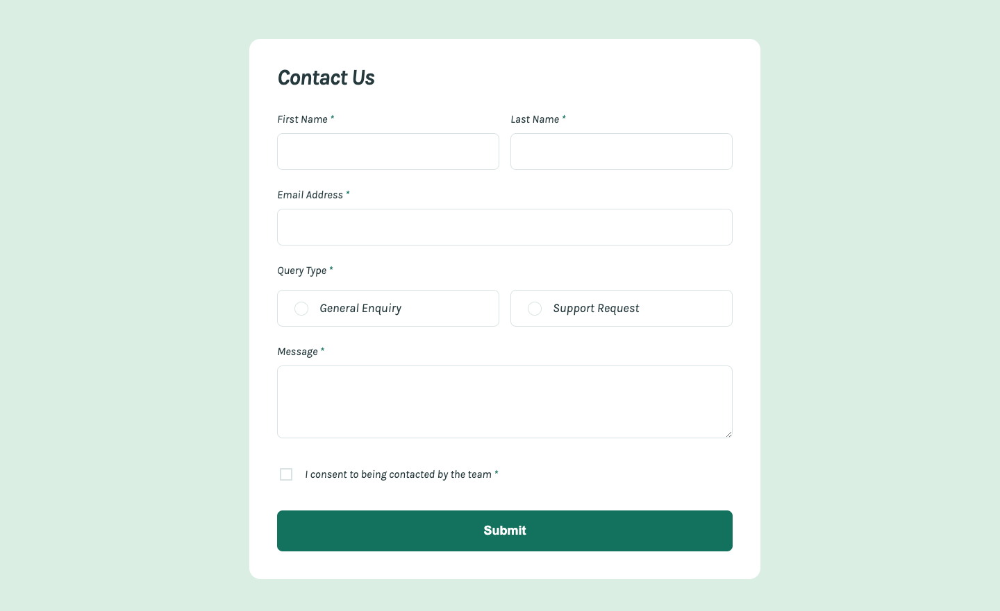

# Frontend Mentor - Contact form solution

This is a solution to the [Contact form challenge on Frontend Mentor](https://www.frontendmentor.io/challenges/contact-form--G-hYlqKJj). Frontend Mentor challenges help you improve your coding skills by building realistic projects.

## Table of contents

- [Overview](#overview)
  - [The challenge](#the-challenge)
  - [Screenshot](#screenshot)
  - [Links](#links)
- [My process](#my-process)
  - [Built with](#built-with)
  - [What I learned](#what-i-learned)
  - [Continued development](#continued-development)
  - [Useful resources](#useful-resources)
- [Author](#author)

## Overview

### The challenge

Users should be able to:

- Complete the form and see a success toast message upon successful submission
- Receive form validation messages if:
  - A required field has been missed
  - The email address is not formatted correctly
- Complete the form only using their keyboard
- Have inputs, error messages, and the success message announced on their screen reader
- View the optimal layout for the interface depending on their device's screen size
- See hover and focus states for all interactive elements on the page

### Screenshot

### Links

- Solution URL: [Here](https://www.frontendmentor.io/solutions/html-css-and-ts-EPzRm2TBlS)
- Live Site URL: [Here](https://nv-contact-form.netlify.app/)

## My process

### Built with

- Semantic HTML5 markup
- CSS custom properties
- Flexbox
- Mobile-first workflow
- Accessibility
- JavaScript
- TypeScript

### What I learned

This challenge taught me the finer details in creating a fully accessible form using HTML, CSS and TypeScript. The form includes the ability to navigate with keyboard, screen reader compatibility and form validation.

### Continued development

Accessibilty is an important aspect of current frontend development and an area that I look forward to continuing to learn better practices to improve as an inclusive dev.

### Useful resources

- [CSS Animations with display: none](https://dev.to/kevinbism/css-animation-with-display-none-4pan#:~:text=The%20@starting-style%20CSS%20rule%20is%20used%20to) - This helped me understand and implement animating from display: none.

## Author

- Portfolio - [Nate Valline](https://natevalline.dev)
- Frontend Mentor - [@nvalline](https://www.frontendmentor.io/profile/nvalline)
- LinkedIn - [Nate Valline](https://www.linkedin.com/in/nvalline)
